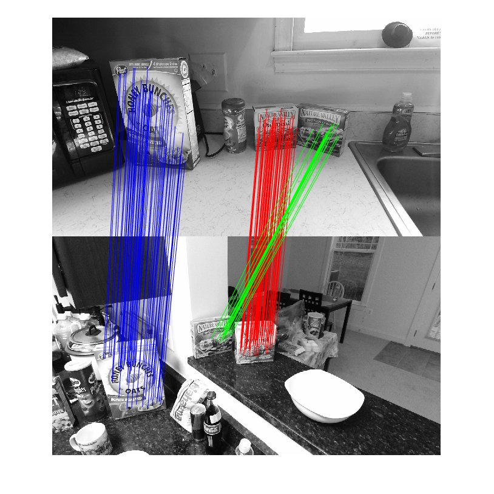

# Learning To Find Good Correspondences Of Multiple Objects

Demo for the ICPR'20 paper "[Learning To Find Good Correspondences Of Multiple Objects](https://inside.mines.edu/~youyexie/paper/WACV2018.pdf)"

   
   
    

# Abstract
Given a set of 3D to 2D putative matches, labeling the correspondences as inliers or outliers plays a critical role in a wide range of computer vision applications including the Perspective-n-Point (PnP) and object recognition. In this paper, we study a more generalized problem which allows the matches to belong to multiple objects with distinct poses. We propose a deep architecture to simultaneously label the correspondences as inliers or outliers and classify the inliers into multiple objects. Specifically, we discretize the 3D rotation space into twenty convex cones based on the facets of a regular icosahedron. For each facet, a facet classifier is trained to predict the probability
of a correspondence being an inlier for a pose whose rotation normal vector points towards this facet. An efficient RANSAC-based post-processing algorithm is also proposed to further process the prediction results and detect the objects. Experiments demonstrate that our method is very efficient compared to existing methods and is capable of simultaneously labeling and classifying the inliers of multiple objects with high precision.

# Directory
- 'Simulation' stores the pre-trained network and all related files that can be used to reproduce the paper's results on simulation data.
- 'GMUkitchen' stores the pre-trained network and all related files that can be used to reproduce the paper's results on [GMUkitchen dataset](https://cs.gmu.edu/~robot/gmu-kitchens.html).

# Citation
If you use our method and/or codes, please cite our paper

```
@inproceedings{xie2020learning,
    author={Xie, Youye and Tang, Yingheng and Tang, Gongguo and Hoff, William},
    title = {Learning To Find Good Correspondences Of Multiple Objects},
    booktitle = {2020 25th International Conference on Pattern Recognition (ICPR)},
    year = {2020}
    organization={IEEE}
}
```
